# Atomic-B

Atomic-B is a modern iOS application that demonstrates clean architecture principles and best practices in Swift development. The project showcases a well-structured, modular approach to building iOS applications with a focus on maintainability, testability, and scalability.

## 🎥 Demo

[Watch Demo Video](https://raw.githubusercontent.com/congpq98/AtomicB/main/Resources/demo.mp4)

## 🏗 Architecture

The project follows Clean Architecture principles with a clear separation of concerns across four distinct layers:

### Core Layers

1. **Presentation Layer** (`Features/`)
   - UIKit-based views and view controllers
   - ViewModels for state management using Combine
   - Coordinators for navigation flow management
   - Builders for dependency injection and view creation

2. **Domain Layer** (`Domain/`)
   - Use case protocols and implementations
   - Domain entities (pure business models)
   - Repository interfaces
   - Domain errors and validation

3. **Data Layer** (`Data/`)
   - Repository implementations
   - Data models (API response models)
   - API endpoints and network configuration
   - Data transformation logic

4. **Infrastructure Layer**
   - `Networking/`: HTTP client and network utilities
   - `AtomicLogger/`: Logging system
   - `AtomicCore/`: Core utilities, protocols, and extensions

### Key Components

```mermaid
classDiagram
    direction TB

    %% Presentation Layer - ViewModels
    class ListUserGitHubViewModel {
        -viewState: ViewState
        -users: [UserEntity]
        -userUseCase: UserUseCase
        +transform(input: Input) Output
        +loadUsers(since: Int) async
        +loadMoreIfNeeded(for: UserEntity)
    }
    class UserDetailViewModel {
        -viewState: ViewState
        -user: UserDetailEntity?
        -userUseCase: UserUseCase
        -username: String
        +transform(input: Input) Output
        +loadUser() async
    }

    %% Presentation Layer - ViewControllers
    class ListUserGitHubViewController {
        -viewModel: ListUserGitHubViewModel
        +delegate: ListUserGitHubViewControllerDelegate?
    }
    class UserDetailViewController {
        -viewModel: UserDetailViewModel
        +delegate: UserDetailViewControllerDelegate?
    }

    %% Presentation Layer - Coordinators
    class ListUserGitHubCoordinator {
        -children: [Coordinator]
        -router: Router
        -userUseCase: UserUseCase
        -delegate: ListUserGitHubCoordinatorDelegate?
        +present(animated: Bool, onDismissed: (() -> Void)?)
        +didSelectUser(user: UserEntity)
    }
    class UserDetailCoordinator {
        -children: [Coordinator]
        -router: Router
        -user: UserEntity
        -userUseCase: UserUseCase
        -delegate: UserDetailCoordinatorDelegate?
        +present(animated: Bool, onDismissed: (() -> Void)?)
        +userDetailViewControllerDidFinish(_: UserDetailViewController)
    }

    %% Domain Layer - Protocols and Entities
    class UserUseCase {
        <<protocol>>
        +getListUser(perPage: Int, since: Int) async throws [UserEntity]
        +getUser(with loginUsername: String) async throws UserDetailEntity
    }
    class UserRepository {
        <<protocol>>
        +getListUser(perPage: Int, since: Int) async throws [UserEntity]
        +getUser(with loginUsername: String) async throws UserDetailEntity
    }
    class UserEntity {
        -id: UUID
        -login: String
        -avatarUrl: String
        -htmlUrl: String
    }
    class UserDetailEntity {
        -id: Int
        -login: String
        -name: String
        -company: String
        -blog: String
        -location: String
        -email: String
        -bio: String
        -publicRepos: Int
        -publicGists: Int
        -followers: Int
        -following: Int
    }

    %% Data Layer - Implementations
    class UserUseCaseImpl {
        -repository: UserRepository
        +getListUser(perPage: Int, since: Int) async throws [UserEntity]
        +getUser(with loginUsername: String) async throws UserDetailEntity
    }
    class UserRepositoryImpl {
        -networkService: NetworkService
        +getListUser(perPage: Int, since: Int) async throws [UserEntity]
        +getUser(with loginUsername: String) async throws UserDetailEntity
    }

    %% Data Layer - Models and Endpoints
    class UserResponse {
        -id: Int
        -login: String?
        -avatarUrl: String?
        -htmlUrl: String?
        +toDomain() UserEntity
    }
    class UserDetailResponse {
        -id: Int
        -login: String?
        -name: String?
        -company: String?
        -blog: String?
        -location: String?
        -email: String?
        -bio: String?
        -publicRepos: Int?
        -publicGists: Int?
        -followers: Int?
        -following: Int?
        +toDomain() UserDetailEntity
    }
    class UserEndpoint {
        +getListUser(Int, Int)
        +getUserDetail(String)
    }

    %% Infrastructure Layer
    class NetworkService {
        <<protocol>>
        +request<T: Decodable>(_ target: Target) async throws T
    }
    class Target {
        <<protocol>>
        +path: String
        +method: HTTPMethod
        +task: Task
        +headers: [String: String]
    }
    class NetworkError {
        <<enum>>
        +noConnection
        +invalidResponse
        +serverError
        +decodingError
        +unknown
    }

    %% Relationships
    ListUserGitHubViewController ..> ListUserGitHubViewModel : uses
    UserDetailViewController ..> UserDetailViewModel : uses

    ListUserGitHubViewModel ..> UserUseCase : uses
    UserDetailViewModel ..> UserUseCase : uses

    UserUseCaseImpl ..|> UserUseCase : implements
    UserUseCaseImpl --> UserRepository : uses

    UserRepositoryImpl ..|> UserRepository : implements
    UserRepositoryImpl --> NetworkService : uses

    UserRepositoryImpl --> UserEndpoint : uses
    UserRepositoryImpl --> UserResponse : transforms
    UserRepositoryImpl --> UserDetailResponse : transforms

    UserResponse --> UserEntity : toDomain()
    UserDetailResponse --> UserDetailEntity : toDomain()

    NetworkService ..> Target : defines request target
    NetworkService ..> NetworkError : throws

    ListUserGitHubCoordinator ..|> Coordinator : implements
    ListUserGitHubCoordinator --> Router : uses
    ListUserGitHubCoordinator --> UserUseCase : uses
    ListUserGitHubCoordinator --> ListUserGitHubViewController : presents
    ListUserGitHubCoordinator --o UserDetailCoordinator : presents child
    ListUserGitHubCoordinator ..> ListUserGitHubCoordinatorDelegate : delegates to

    UserDetailCoordinator ..|> Coordinator : implements
    UserDetailCoordinator --> Router : uses
    UserDetailCoordinator --> UserUseCase : uses
    UserDetailCoordinator --> UserDetailViewController : presents
    UserDetailCoordinator ..> UserDetailCoordinatorDelegate : delegates to

    Coordinator o-- Coordinator : manages children
```



## 🚀 Features

### User Management
- **User List**: Display GitHub users with infinite scroll pagination
- **User Details**: View comprehensive user profiles with detailed information
- **Asynchronous Loading**: Efficient image loading and data fetching
- **Error Handling**: Comprehensive error states with retry mechanisms
- **State Management**: Reactive UI updates using Combine framework

### Technical Features
- **Clean Architecture**: Strict separation of concerns across layers
- **Protocol-Oriented Design**: Dependency inversion through protocols
- **Async/Await**: Modern concurrency patterns throughout the app
- **Combine Integration**: Reactive programming for state management
- **Dependency Injection**: Builder pattern for clean dependency management
- **Coordinator Pattern**: Clean navigation flow management
- **Unit Testing**: Comprehensive test coverage with mocking

## 📦 Project Structure

```
Atomic-B/
├── Application/          # App lifecycle and configuration
│   ├── AppDelegate.swift
│   ├── SceneDelegate.swift
│   ├── AppConfig.swift
│   └── Environment.swift
├── Features/            # Feature modules (Presentation Layer)
│   └── Users/          # User-related features
│       ├── List/       # User list feature
│       │   ├── ListUserGitHubViewController.swift
│       │   ├── ListUserGitHubViewModel.swift
│       │   ├── ListUserGitHubCoordinator.swift
│       │   ├── ListUserViewControllerBuilder.swift
│       │   └── UserCell.swift
│       ├── Detail/     # User detail feature
│       │   ├── UserDetailViewController.swift
│       │   ├── UserDetailViewModel.swift
│       │   ├── UserDetailCoordinator.swift
│       │   └── UserDetailViewControllerBuilder.swift
│       └── Builders/   # View builders
│           └── ViewControllerBuilder.swift
├── Domain/             # Business logic (Domain Layer)
│   ├── Entities/       # Domain entities
│   │   ├── UserEntity.swift
│   │   └── UserDetailEntity.swift
│   ├── Interfaces/     # Abstraction for data layer
│   │   └── Repositories/
│   │       └── UserRepository.swift
│   └── UseCase/        # Business logic and protocols
│       ├── Protocol/
│       │   └── UserUseCase.swift
│       └── UserUseCaseImpl.swift
├── Data/              # Data layer implementation
│   ├── Models/        # Data models (API responses)
│   │   ├── User.swift
│   │   └── UserDetail.swift
│   ├── Repository/    # Repository implementations
│   │   └── UserRepositoryImpl.swift
│   └── Network/       # Network-related components
│       ├── Endpoint/
│       │   └── UserEndpoint.swift
│       └── Interceptor/
│           └── LoggingInterceptor.swift
├── Router/            # Navigation infrastructure
│   └── SceneRouter.swift
├── Networking/        # Networking module (separate package)
├── AtomicLogger/      # Logging module (separate package)
├── AtomicCore/        # Core utilities (separate package)
└── Atomic-BTests/     # Test suite
    ├── Unit/
    │   └── ViewModel/
    │       ├── ListUserGitHubViewModelTests.swift
    │       └── UserDetailViewModelTests.swift
    ├── Helpers/
    └── Mocks/
        └── MockUserUseCase.swift
```

## 🛠 Technical Stack

- **Language**: Swift 5.9+
- **UI Framework**: UIKit with programmatic UI
- **Architecture**: Clean Architecture with MVVM
- **State Management**: Combine framework
- **Networking**: URLSession with async/await
- **Dependency Injection**: Builder pattern
- **Navigation**: Coordinator pattern
- **Testing**: XCTest with comprehensive mocking
- **Dependency Management**: Swift Package Manager
- **Code Quality**: SwiftLint, SwiftFormat

## 🧪 Testing Strategy

The project implements a comprehensive testing strategy focused on business logic and user interactions:

### 1. Unit Tests
- **ViewModel Tests**: State management, user interactions, error handling, and pagination logic
- **Use Case Tests**: Business logic validation and data transformation
- **Repository Tests**: Data layer integration and error handling

### 2. Test Organization
```
Atomic-BTests/
├── Unit/
│   ├── ViewModel/
│   │   ├── ListUserGitHubViewModelTests.swift
│   │   └── UserDetailViewModelTests.swift
│   ├── UseCase/
│   └── Repository/
├── Helpers/
│   └── TestData.swift
└── Mocks/
    └── MockUserUseCase.swift
```

### 3. Testing Principles
- **Isolation**: Each test is independent with proper mocking
- **Coverage**: Focus on business logic and user interactions
- **Maintainability**: Clear test structure with descriptive names
- **Performance**: Fast execution with minimal dependencies

### 4. Running Tests

```bash
# Run all tests
xcodebuild test -scheme Atomic-B -destination 'platform=iOS Simulator,name=iPhone 16 Pro,OS=18.5'

# Run specific test target
xcodebuild test -scheme Atomic-B -only-testing:Atomic-BTests/ListUserGitHubViewModelTests -destination 'platform=iOS Simulator,name=iPhone 16 Pro,OS=18.5'
```

## 🔄 CI/CD Pipeline

The project uses GitHub Actions for continuous integration:

1. **Pre-commit Hooks**
   - Code formatting (SwiftFormat)
   - Linting (SwiftLint)
   - Basic tests

2. **Pull Request Checks**
   - Automated testing
   - Code quality checks
   - Build verification

## 📚 Documentation

- **Architecture Documentation**: This README provides comprehensive architecture overview
- **API Documentation**: Inline documentation for all public APIs
- **Testing Guidelines**: Clear testing patterns and best practices
- **Contribution Guidelines**: Development workflow and standards

## 🔧 Development Setup

1. **Prerequisites**
   - Xcode 15.0+
   - Swift 5.9+
   - iOS 18.5+ Simulator

2. **Installation**
   ```bash
   git clone https://github.com/congpq98/AtomicB.git
   cd AtomicB
   xcodebuild -resolvePackageDependencies
   ```

3. **Running the App**
   ```bash
   xcodebuild -scheme Atomic-B -destination 'platform=iOS Simulator,name=iPhone 16 Pro,OS=18.5' build
   ```

4. **Running Tests**
   ```bash
   xcodebuild test -scheme Atomic-B -destination 'platform=iOS Simulator,name=iPhone 16 Pro,OS=18.5'
   ```

## 📝 Code Style

The project follows strict code style guidelines:

- **SwiftLint**: Enforces code consistency and best practices
- **SwiftFormat**: Automatic code formatting
- **Documentation**: Comprehensive inline documentation for public APIs
- **Naming Conventions**: Clear and descriptive naming throughout
- **Architecture Patterns**: Consistent use of Clean Architecture principles

## 🤝 Contributing

1. Fork the repository
2. Create a feature branch (`git checkout -b feature/amazing-feature`)
3. Commit your changes (`git commit -m 'Add some amazing feature'`)
4. Push to the branch (`git push origin feature/amazing-feature`)
5. Open a Pull Request

### Development Guidelines
- Follow Clean Architecture principles
- Write comprehensive unit tests
- Maintain code documentation
- Use SwiftLint and SwiftFormat
- Follow the established naming conventions

## 📄 License

This project is licensed under the terms of the license included in the `LICENSE` file.
