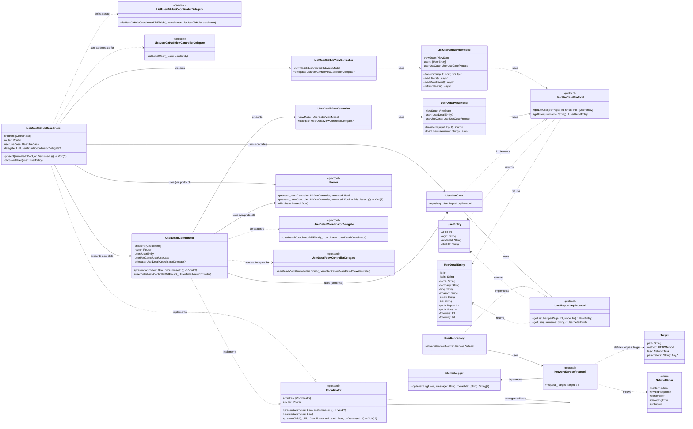

# Atomic-B

Atomic-B is a modern iOS application that demonstrates clean architecture principles and best practices in Swift development. The project showcases a well-structured, modular approach to building iOS applications with a focus on maintainability, testability, and scalability.

## 🎥 Demo

https://github.com/congpq98/AtomicB/assets/40276297/bd911090-0657-4b54-8e64-3e41cd6839dd


## 🏗 Architecture

The project follows Clean Architecture principles with a clear separation of concerns:

### Core Layers

1. **Presentation Layer** (`Features/`)
   - UIKit-based views
   - ViewModels for state management
   - Coordinators for navigation
   - Builders for dependency injection

2. **Domain Layer** (`Domain/`)
   - Use cases (business logic)
   - Entity models
   - Repository interfaces

3. **Data Layer** (`Data/`)
   - Repository implementations
   - Data sources
   - Data models

4. **Infrastructure Layer**
   - `Networking/`: API client and network utilities
   - `AtomicLogger/`: Logging system
   - `AtomicCore/`: Core utilities and extensions

### Key Components



This diagram provides a clear visual representation of your `Atomic-B` project's architecture, showing the relationships and responsibilities of key components across different layers: Presentation, Domain, Data, and Infrastructure.

## 🚀 Features

### User Management
- List GitHub users with pagination
- View detailed user profiles
- Asynchronous image loading
- Error handling and retry mechanisms

### Technical Features
- UIKit-based UI
- Combine for reactive programming
- Async/await for concurrency
- Dependency injection
- Unit testing
- CI/CD integration

## 📦 Project Structure

```
Atomic-B/
├── Application/          # App configuration and setup
├── Features/            # Feature modules
│   └── Users/          # User-related features
│       ├── List/       # User list feature
│       ├── Detail/     # User detail feature
│       └── Builders/   # View builders
├── Domain/             # Business logic and entities
├── Data/              # Data layer implementation
├── Networking/        # Networking module (with its own tests)
├── Atomic-BTests/      # Main app test target
│   ├── Unit/
│   ├── Helpers/
│   └── Mocks/
└── Base.lproj/        # Localization resources
```

## 🛠 Technical Stack

- **Language**: Swift 5.9+
- **UI Framework**: UIKit
- **Architecture**: Clean Architecture
- **State Management**: Combine
- **Networking**: URLSession with async/await
- **Testing**: XCTest
- **Dependency Management**: Swift Package Manager
- **Code Quality**: SwiftLint, SwiftFormat

## 🧪 Testing Strategy

The project implements a layered and modular testing strategy:

### 1. Unit Tests
- **ViewModel Tests**: State management, user interaction, error handling, and pagination logic.

### 4. Networking Module Tests
- All low-level network protocol, error, and response handling are tested within the `Networking` module itself. This project does **not** duplicate those tests, but instead focuses on integration and business logic.

### 5. Test Infrastructure
- **Helpers**: Common test data generators and utilities.
- **Mocks**: For repositories, use cases, and services.

### 6. Test Organization

```
Atomic-BTests/
├── Unit/
│   ├── ViewModel/
├── Helpers/
└── Mocks/
```

### 7. Running Tests

```bash
# Run all tests
xcodebuild test -scheme Atomic-B -destination 'platform=iOS Simulator,name=iPhone 16 Pro,OS=18.5'
```

> **Note:** The Networking module has its own test suite. This project focuses on testing business logic, integration, and UI, not duplicating low-level network tests.

## 🔄 CI/CD Pipeline

The project uses GitHub Actions for continuous integration:

1. **Pre-commit Hooks**
   - Code formatting (SwiftFormat)
   - Linting (SwiftLint)
   - Basic tests

## 📚 Documentation

- Architecture documentation
- API documentation
- Testing guidelines
- Contribution guidelines

## 🔧 Development Setup

1. **Prerequisites**
   - Xcode 15.0+
   - Swift 5.9+

2. **Installation**
   ```bash
   git clone https://github.com/congpq98/AtomicB.git
   cd AtomicB
   xcodebuild -resolvePackageDependencies
   ```

3. **Running Tests**
   ```bash
   xcodebuild test -scheme Atomic-B -destination 'platform=iOS Simulator,name=iPhone 16 Pro,OS=18.5'
   ```

## 📝 Code Style

The project follows strict code style guidelines:

- SwiftLint rules for code consistency
- SwiftFormat for automatic formatting
- Documentation comments for public APIs
- Clear naming conventions

## 🤝 Contributing

1. Fork the repository
2. Create a feature branch
3. Commit your changes
4. Push to the branch
5. Create a Pull Request

## 📄 License

This project is licensed under the terms of the license included in the `LICENSE` file.
