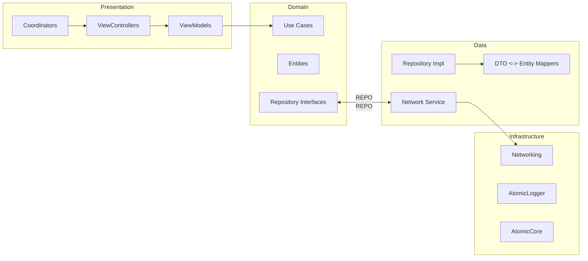
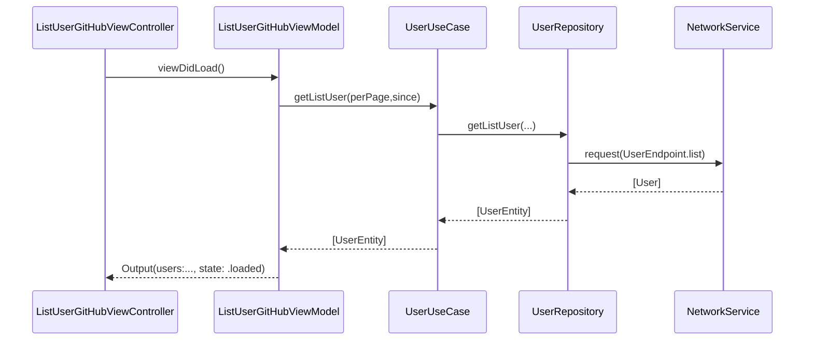

# AtomicArch — High-Level Design

This document describes the overall system architecture, module boundaries, key flows, and cross-cutting concerns for AtomicArch. It complements the README by focusing on why things are structured the way they are and how components interact at runtime.

## 1. Goals and Non‑Goals

- Goals
  - Enforce Clean Architecture separation (Presentation, Domain, Data, Infrastructure)
  - High testability via dependency inversion and small seams
  - Replaceable data sources and UI layers with minimal ripple effects
  - Predictable navigation and state handling
- Non‑Goals
  - No persistence layer in v1 (can be added as a Data source later)
  - No complex feature flag system; configuration is compile‑time or simple runtime flags

## 2. Architecture Overview

AtomicArch follows Clean Architecture, enforcing inward dependencies:

- Presentation (UIKit + MVVM + Coordinator)
- Domain (Use Cases + Entities + Repository Interfaces)
- Data (Repositories + Mappers + Network layer)
- Infrastructure (Shared modules: Networking, AtomicLogger, AtomicCore)

Key principle: Presentation depends only on Domain; Domain depends on no one; Data depends on Domain and Infrastructure; Infrastructure is leaf/shared.

## 3. Module Boundaries

- AtomicArch (App)
  - Wires features, owns app lifecycle, and composes modules.
- AtomicCore
  - Reusable building blocks: Coordinator, Router, View, ViewModel base protocols/utilities.
- Networking
  - Request execution, interceptors, reachability, error mapping, Target abstractions.
- AtomicLogger
  - Centralized logging with levels and networking extensions.

These are Swift Packages to enable independent testing, reuse, and compile parallelism.

## 4. Domain Model and Contracts

- Entities: `UserEntity`, `UserDetailEntity` — business‑centric, UI‑agnostic.
- Use Cases:
  - `UserUseCase.getListUser(perPage:since:) -> [UserEntity]`
  - `UserUseCase.getUser(with:) -> UserDetailEntity`
- Repository Interface:
  - `UserRepository` mirrors Use Case needs; implemented in Data layer.

Contracts are protocols to enable mocking in tests and swapping implementations.

## 5. Data Layer Responsibilities

- Implements `UserRepository` by orchestrating:
  - Endpoints (`UserEndpoint`)
  - Network service (`NetworkService`)
  - DTOs (`User`, `UserDetail`) and mappers to entities
- Error translation: Network errors -> domain‑friendly errors
- No persistence in v1; add `LocalDataSource` later if needed.

## 6. Presentation Layer Design

- MVVM
  - ViewModels expose Inputs/Outputs and async methods for effects
  - Pure business decisions delegated to Use Cases
- Coordinators
  - Encapsulate navigation flows (push/present/dismiss)
  - Own child coordinator lifetimes; communicate via delegate
- Builders
  - Create VCs with dependencies injected (Use Cases, Routers, etc.)

Example: User List Flow

## 7. Navigation

- `Coordinator` protocol (AtomicCore) defines lifecycle and child management
- `Router` abstracts pushing/presenting/dismissing
- Feature Coordinators compose screens and propagate events upward

## 8. Error Handling Strategy

- Network errors normalized by `Networking.NetworkError`
- ViewModels map errors to user‑friendly states (retry, empty, error)
- Logging via `AtomicLogger` with levels; network requests logged via interceptor

## 9. Concurrency and Reactivity

- Async/await for I/O bound operations in Use Cases and Data layer
- Combine for UI state binding and event streams in ViewModels
- Avoid blocking the main thread; isolate heavy work if needed

## 10. Testing Strategy

- Unit tests at three layers:
  - ViewModel tests with mocked Use Cases
  - Use Case tests with mocked Repositories
  - Repository tests with mocked `NetworkService`
- Test helpers/mocks live alongside test targets

## 11. Configuration and Environments

- `Environment.swift` and `UATConfig.xcconfig` for simple runtime/config flags
- Future: add per‑environment base URLs, feature switches

## 12. Observability

- Structured logs via `AtomicLogger`
- Potential future: hooks for metrics, tracing spans for network calls

## 13. Extensibility Roadmap

- Add persistence (e.g., SQLite/CoreData) as a LocalDataSource with repository merge
- Add offline caching and cache policies
- Add new features via new Coordinators and Use Cases without cross‑layer changes
- Add DI container if complexity grows (Swinject/Needle) — optional

## 14. Non‑Functional Requirements

- Build: Xcode 15+, Swift 5.9+
- Platforms: iOS Simulator 18.5+ used in CI; app targets current iOS
- CI: PR lint/test; main push test; tag‑push release with templated notes

## 15. Security and Permissions

- No sensitive secrets in repo; GitHub `GITHUB_TOKEN` used in CI
- Future: secure storage for API keys (Keychain) if needed

---
This HLD will evolve with the codebase. Propose changes via PRs to `docs/HIGH_LEVEL_DESIGN.md`.
